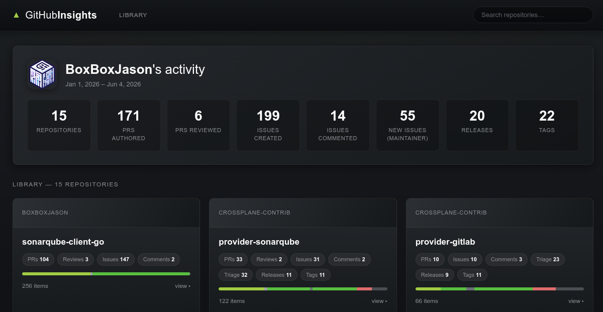

# github-insights

Collect comprehensive activity insights from GitHub. Track your contributions—pull requests, code reviews, issues, mentions, and releases—across a date range and output structured data for reporting, analysis, or documentation.



## Features

- **Pull Request Tracking** — Capture all PRs you authored and reviewed
- **Issue Analytics** — Track issues created and commented on
- **Mention Detection** — Find all mentions of your username across repositories
- **Release & Tag Monitoring** — Track releases and tags in repositories you maintain
- **Flexible Configuration** — Use YAML config, command-line flags, or environment variables
- **Structured Output** — JSON files organized by repository for easy analysis
- **Rate Limit Aware** — Efficient GitHub API usage with automatic rate limit handling

## Quick Start

### 1. Install

```bash
go install github.com/boxboxjason/github-insights@latest
```

### 2. Set Up Authentication (Optional)

Optionally provide your GitHub token via environment variable. If not provided, you must specify a username:

```bash
export GITHUB_TOKEN="your_github_personal_access_token"
```

### 3. Run

Collect activity for a date range:

```bash
github-insights --start 2024-01-01 --end 2024-03-31
```

The tool will create an `out/` directory with JSON files containing your GitHub activity.

## Usage

### Command-Line Flags

```bash
github-insights \
  --start 2024-01-01 \
  --end 2024-03-31 \
  --username octocat \
  --token $GITHUB_TOKEN \
  --out ./results \
  --maintained owner/repo,owner/another-repo
```

| Flag | Description | Required |
|------|-------------|----------|
| `--start` | Start date (RFC3339 or YYYY-MM-DD) | Yes |
| `--end` | End date (RFC3339 or YYYY-MM-DD), defaults to now | No |
| `--username` | GitHub username to query | No* |
| `--token` | GitHub personal access token | No* |
| `--out` | Output directory for JSON files (default: `out`) | No |
| `--maintained` | Comma-separated list of repos you maintain | No |
| `--config` | Path to YAML config file | No |

*Resolved from flag → environment variables → config file. If no token is provided, username becomes required.

### Configuration File

Create a `config.yaml` (or `config.yml`) in your working directory:

```yaml
username: octocat
start: 2024-01-01
end: 2024-03-31
token: ghp_xxxxxx  # Optional; if not provided, username becomes required
output_dir: ./results
maintained_repos:
  - owner/repo1
  - owner/repo2
```

The tool automatically loads `config.yaml` if no `--config` flag is provided.

### Environment Variables

```bash
export GITHUB_TOKEN="ghp_xxxxxx"
export GITHUB_USERNAME="octocat"
github-insights --start 2024-01-01
```

### Resolution Order

Settings are resolved in this order (later values override earlier ones):

1. Config file (`config.yaml` or specified with `--config`)
2. Environment variables (`GITHUB_TOKEN`, `GITHUB_USERNAME`)
3. Command-line flags

## Output

The tool generates JSON files in your output directory organized by repository:

```plaintext
out/
  repo_owner_name.json          # PR and issue insights
  repo_owner_releases.json      # Release information
  repo_owner_tags.json          # Tag information
  repo_owner_maintainer.json    # Maintainer issues (for maintained repos)
```

Each file contains structured data about your activity in that repository.

## Viewer

A static, Steam-themed web viewer lives in `frontend/`. It presents your collected
reports as a "library" of repositories (game-capsule cards) with a per-repository
detail view for PRs, reviews, issues, mentions, releases, and tags. No backend or
build step is required — it runs from a single HTML file.

Because browsers cannot list a directory, a small script bundles your JSON reports
into `frontend/data.js` first:

```bash
make frontend-data        # bundles results/*.json -> frontend/data.js
xdg-open frontend/index.html
```

The viewer reads from the `results/` directory by default. Re-run `make frontend-data`
whenever you collect new reports, since the bundle is a snapshot. The generated
`frontend/data.js` is gitignored, as it embeds the same private data as `results/`.

> If your reports are in a different output directory, point the script at it or
> copy them into `results/` before bundling.

## Examples

### Analyze Your Activity for Q1

```bash
github-insights \
  --start 2024-01-01 \
  --end 2024-03-31 \
  --out ./q1-report
```

### Track Maintained Repositories

If you maintain certain repositories, specify them to capture release and tag information:

```bash
github-insights \
  --start 2024-01-01 \
  --username myusername \
  --maintained owner/my-project,owner/my-library \
  --out ./maintainer-report
```

### Auto-Discover Maintained Repos

If you don't specify `--maintained`, the tool automatically discovers repositories where you have admin, maintain, or push permissions:

```bash
github-insights --start 2024-01-01
```

## Requirements

- Go 1.25.9 or later
- GitHub username (required if token is not provided)
- GitHub personal access token (optional; with appropriate scopes for better rate limits)

### GitHub Token Scopes

For full functionality, your token should have access to:

- `public_repo` — Access to public repositories
- `read:user` — Read user profile information
- `repo` (optional) — For private repositories

## Troubleshooting

### Missing GitHub Token or Username

If no token is provided, you must specify a username:

```plaintext
Error: missing GitHub username: set --username, GITHUB_USERNAME env var, or config username (required when no token is provided)
```

Provide either a GitHub token OR a username via environment variable, flag, or config file.

### Invalid Date Format

Dates must be in `RFC3339` or `YYYY-MM-DD` format:

- ✅ `2024-01-15`
- ✅ `2024-01-15T10:30:00Z`
- ❌ `01/15/2024`

### No Maintained Repos Discovered

If you don't specify repositories and the tool finds none, it will skip release/tag and maintainer insights:

```plaintext
No maintained repos discovered; release/tag and maintainer issue insights will be skipped
```

Explicitly provide repos with `--maintained` or ensure your token has permission to list repositories.

## Project Structure

```plaintext
cmd/github-insights/     # CLI entry point
internal/
  config/                # Configuration loading and parsing
  gh/                    # GitHub client wrapper
  collector/             # Activity collection logic
    - collect_prs.go
    - collect_issues.go
    - collect_mentions.go
    - collect_maintainer.go
    - output.go
frontend/                # Static Steam-themed viewer for the JSON reports
  - index.html
  - styles.css
  - app.js
  - generate.sh          # Bundles results/*.json into data.js
```

## Contributing

Contributions are welcome. Feel free to open issues or submit pull requests.
